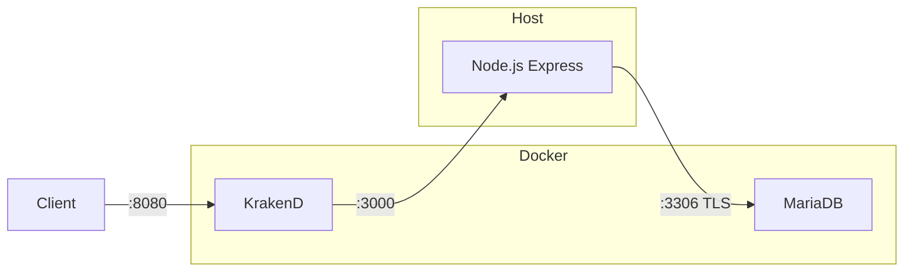
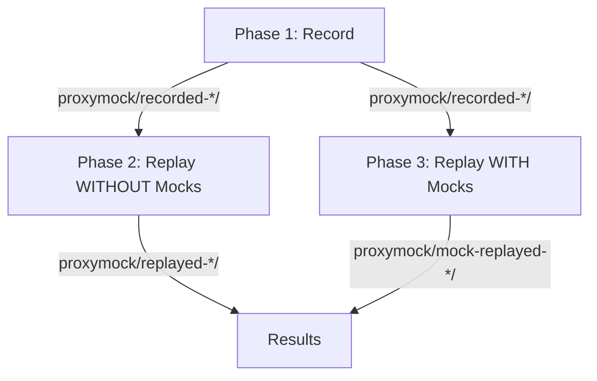
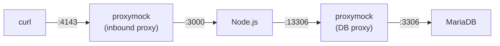
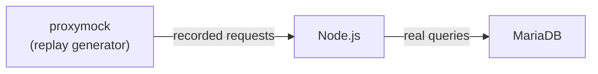
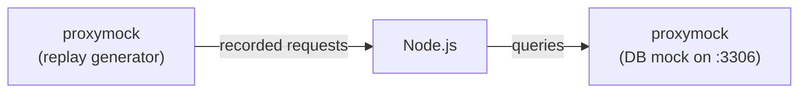

# Node.js + MariaDB + KrakenD Demo

A CRUD products API built with **Node.js/Express**, backed by **MariaDB** with **TLS encryption**, fronted by a **KrakenD** API gateway. The Node app runs directly on the host so you can easily capture and replay traffic with `proxymock` or `speedctl`.

## Architecture



- **KrakenD** (Docker) -- API gateway on port 8080, proxies to Node on the host
- **Node.js** (Host) -- Express CRUD API, runs natively for easy `speedctl` capture
- **MariaDB** (Docker) -- Database with TLS enforced (`require_secure_transport = ON`)

## API Endpoints

All endpoints are available through KrakenD on port `8080` (or directly on `3000`):

| Method | Path | Description |
|--------|------|-------------|
| GET | `/health` | Health check (verifies DB connectivity) |
| GET | `/products` | List all products |
| GET | `/products/:id` | Get a single product |
| POST | `/products` | Create a product (`{"name", "price", "quantity"}`) |
| PUT | `/products/:id` | Update a product |
| DELETE | `/products/:id` | Delete a product |

## Quick Start

```bash
# 1. Generate TLS certificates for MariaDB
make certs

# 2. Start MariaDB + KrakenD in Docker
make infra

# 3. Run the Node app on the host (new terminal)
make local

# 4. Send test traffic
make client
```

## Deploy on EC2 (Amazon Linux 2023 / Ubuntu)

### Prerequisites

- An EC2 instance (t3.small or larger)
- Security group allowing inbound on ports **22** (SSH) and **8080** (API)
- SSH access to the instance

### Step-by-step

**1. Install Docker, Node.js, and Git**

Amazon Linux 2023:

```bash
sudo dnf update -y
sudo dnf install -y docker git nodejs20
sudo systemctl enable --now docker
sudo usermod -aG docker $USER

# Docker Compose plugin
sudo mkdir -p /usr/local/lib/docker/cli-plugins
sudo curl -SL "https://github.com/docker/compose/releases/latest/download/docker-compose-linux-$(uname -m)" \
  -o /usr/local/lib/docker/cli-plugins/docker-compose
sudo chmod +x /usr/local/lib/docker/cli-plugins/docker-compose

# Log out and back in so the docker group takes effect
exit
```

Ubuntu:

```bash
sudo apt-get update && sudo apt-get install -y docker.io docker-compose-v2 git nodejs npm
sudo systemctl enable --now docker
sudo usermod -aG docker $USER
exit
```

**2. Clone the repo**

```bash
git clone https://github.com/speedscale/demo.git
cd demo/node-mariadb
```

**3. Generate TLS certificates and start infrastructure**

```bash
make certs
make infra
```

**4. Install dependencies and start the Node app**

```bash
make local
```

This runs the Node.js API directly on the host on port 3000. KrakenD (in Docker) proxies to it via `host.docker.internal`.

**5. Test the API**

In another terminal (or from your laptop replacing `localhost` with the EC2 public IP):

```bash
# Via KrakenD gateway
curl http://localhost:8080/products

# Create a product
curl -X POST http://localhost:8080/products \
  -H 'Content-Type: application/json' \
  -d '{"name":"EC2 Widget","price":29.99,"quantity":5}'

# Direct to Node (bypasses gateway)
curl http://localhost:3000/health
```

## Automated Test Lifecycle (proxymock)

The `test-all.sh` script runs the complete record-replay-mock lifecycle in one command. No Speedscale cloud account required -- everything runs locally using [proxymock](https://docs.speedscale.com/proxymock/).

### Install proxymock

```bash
sh -c "$(curl -Lfs https://downloads.speedscale.com/proxymock/install-proxymock)"
```

### Run everything

```bash
make test-all
```

This executes three phases automatically:



### Phase 1: Record traffic

```bash
make test-record
```

Records all HTTP and MariaDB traffic flowing through the Node app:



- proxymock intercepts inbound HTTP on port **4143** and forwards to the app on **3000**
- proxymock intercepts outbound DB traffic on port **13306** and forwards to real MariaDB on **3306**
- All request/response pairs are saved as RRPair files in `proxymock/recorded-*/`

### Phase 2: Replay WITHOUT mocks

```bash
make test-replay
```

Replays the recorded HTTP traffic against the Node app with the **real MariaDB** still running. This validates that the recorded traffic produces correct responses when backends are live.



### Phase 3: Replay WITH mocks

```bash
make test-mock
```

Stops the real MariaDB and replays traffic with proxymock **simulating the database**. This proves the app works correctly with mocked backends -- no database needed.



### Inspect recorded traffic

After recording, you can browse the captured traffic in a terminal UI:

```bash
make inspect
```

### Run phases independently

Each phase can be run standalone. Phases 2 and 3 use the most recent recording automatically:

```bash
make test-record    # Phase 1 only
make test-replay    # Phase 2 only (needs prior recording)
make test-mock      # Phase 3 only (needs prior recording)
```

### Output directories

After `make test-all`, the `proxymock/` directory contains:

```
proxymock/
  recorded-YYYYMMDD-HHMMSS/       # Phase 1: captured RRPairs (HTTP + MariaDB)
  replayed-YYYYMMDD-HHMMSS/       # Phase 2: replay results (real DB)
  mocked-YYYYMMDD-HHMMSS/         # Phase 3: mock server responses
  mock-replayed-YYYYMMDD-HHMMSS/  # Phase 3: replay results (mocked DB)
```

## Manual Capture with speedctl (Speedscale Cloud)

For cloud-connected capture and replay with the [Speedscale platform](https://app.speedscale.com), use `speedctl` instead. Because the Node app runs on the host (not in a container), `speedctl capture` works natively.

### 1. Install speedctl

```bash
sh -c "$(curl -Lfs https://downloads.speedscale.com/speedctl/install)"
speedctl init
```

### 2. Start infrastructure and capture

```bash
make infra          # Start MariaDB + KrakenD
make capture        # Terminal 1: starts speedctl capture on :4143
```

### 3. Start the Node app with outbound proxy

In **Terminal 2**:

```bash
export GLOBAL_AGENT_HTTP_PROXY='http://127.0.0.1:4140'
export GLOBAL_AGENT_HTTPS_PROXY='http://127.0.0.1:4140'
export GLOBAL_AGENT_NO_PROXY='*127.0.0.1:12557'
export NODE_EXTRA_CA_CERTS=${HOME}/.speedscale/certs/tls.crt
DB_HOST=127.0.0.1 DB_SSL_CA=./certs/ca.pem npm start
```

### 4. Generate and replay traffic

In **Terminal 3**:

```bash
make client-capture   # Send traffic through speedctl proxy on :4143
```

After creating a snapshot in the [Speedscale UI](https://app.speedscale.com):

```bash
speedctl replay $SNAPSHOT_ID \
  --test-config-id standard \
  --http-port 4140 \
  --custom-url http://localhost:3000
```

## Verifying TLS is active

```bash
docker exec -it demo-mariadb mariadb -u demo -pdemo_password -e "SHOW STATUS LIKE 'Ssl_cipher';"
```

You should see a cipher like `TLS_AES_256_GCM_SHA384`. The Node.js logs will also show:

```
TLS enabled – CA cert loaded from ./certs/ca.pem
```

## Make Targets

```
make help            Show all targets
make certs           Generate TLS certificates for MariaDB
make build           Install Node dependencies
make infra           Start MariaDB + KrakenD in Docker
make local           Run Node.js API on the host (port 3000)
make capture         Start speedctl capture proxy (port 4143 -> 3000)
make client          Send sample traffic via KrakenD (:8080)
make client-capture  Send sample traffic via speedctl proxy (:4143)
make test-all        Automated: record -> replay -> mock (all 3 phases)
make test-record     Automated: Phase 1 only (record traffic)
make test-replay     Automated: Phase 2 only (replay, real DB)
make test-mock       Automated: Phase 3 only (replay, mocked DB)
make inspect         Browse recorded traffic in proxymock TUI
make down            Stop Docker containers
make clean           Stop containers, remove volumes + certs + recordings
make logs            Tail Docker logs
```

## Project Structure

```
node-mariadb/
  server.js          – Express CRUD API
  package.json       – Node dependencies
  krakend.json       – KrakenD gateway config (proxies to host.docker.internal:3000)
  compose.yaml       – Docker Compose (MariaDB + KrakenD only, Node runs on host)
  Dockerfile         – Multi-stage Node.js image (for optional containerized deploys)
  test-all.sh        – Automated record -> replay -> mock lifecycle
  gen-certs.sh       – Generates self-signed CA + server certs for MariaDB TLS
  mariadb-tls.cnf    – MariaDB TLS config
  Makefile           – Convenience targets
  api.http           – VS Code REST Client / IntelliJ HTTP requests
  certs/             – Generated TLS certificates (git-ignored)
  proxymock/         – Recorded/replayed traffic (git-ignored)
```

## Environment Variables

| Variable | Default | Description |
|----------|---------|-------------|
| `PORT` | `3000` | Node.js listen port |
| `DB_HOST` | `127.0.0.1` | MariaDB hostname |
| `DB_PORT` | `3306` | MariaDB port |
| `DB_USER` | `demo` | Database user |
| `DB_PASSWORD` | `demo_password` | Database password |
| `DB_NAME` | `demo` | Database name |
| `DB_SSL_CA` | *(empty)* | Path to CA cert for TLS (leave empty to disable) |
