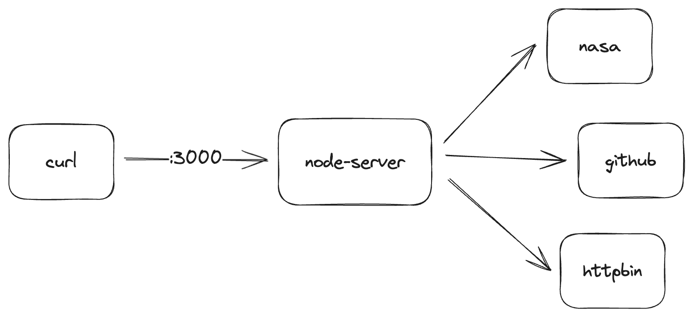
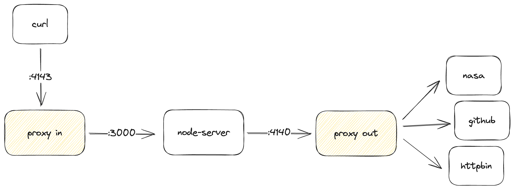
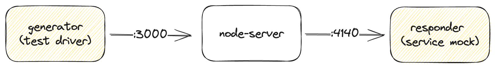

# Great App: node-server

This app has a couple of different endpoints:
* `/` returns a generic response
* `/events` reads some GitHub events
* `/space` will call the SpaceX launches API
* `/nasa` will get the NASA picture of the day (as JSON)
* `/bin` calls `httpbin`

After you get the application running on your machine, you're going to capture traffic with Speedscale like so:

And once you're able to process the traffic properly, you are going to replay the tests and mocks like so which lets you run numerous different scenarios and isolate yourself from the backend dependencies.

## Choose Your Adventure

The next step is to get the application working in your environment. You can choose what kind of environment you want to work with and follow the specific instructions:

* [Kubernetes](docs-k8s.md) - choose this if you have a `kubernetes` cluster and want to run everything inside k8s
* [Local Environment](docs-local.md) - choose this if you have `nodejs` installed and want to run everything locally
* [Docker Environment](docs-docker.md) - choose this if you have `docker` installed and want to run everything in containers
* **Something Else??** - if you are want to see instructions for a different environment, open up an [issue](https://github.com/speedscale/node-server/issues) on this project and let us know

## Other Questions??

If you have questions about how to work with this demo, come by the [Speedscale Community](https://slack.speedscale.com) and let us know, thanks!
