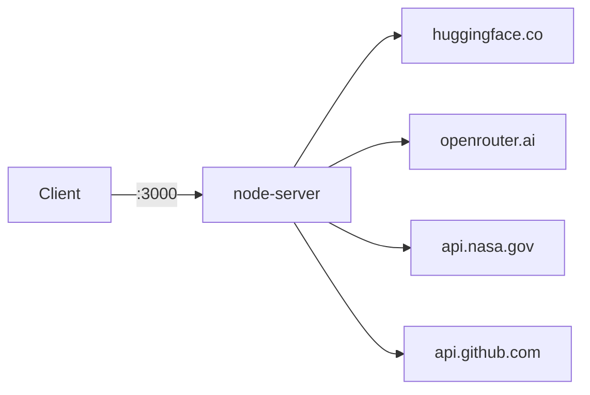
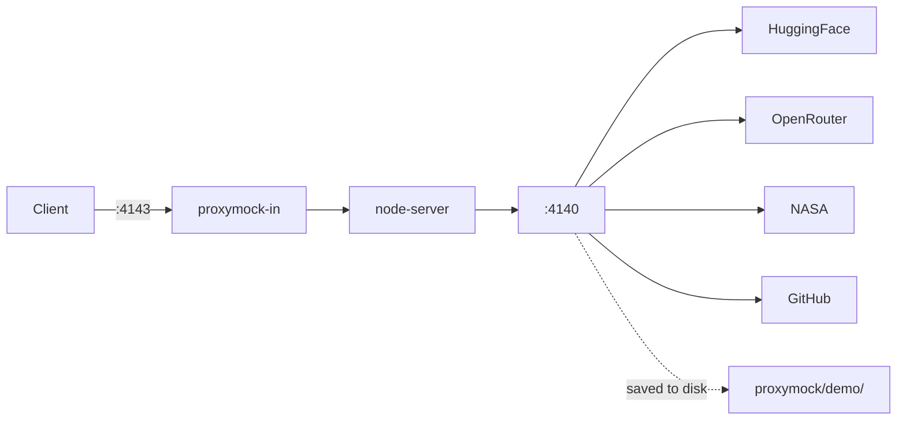
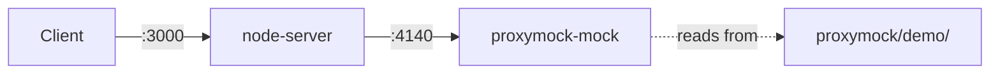

# node-server

Express app that calls external APIs — useful for demonstrating proxymock record, mock, and replay.

## Endpoints

* `/` — generic response
* `/models` — top downloaded models from [Hugging Face](https://huggingface.co)
* `/models/:org/:model` — details for a specific model (e.g. `/models/deepseek-ai/DeepSeek-R1`)
* `/llm/models` — LLM model catalog and pricing from [OpenRouter](https://openrouter.ai)
* `/nasa` — NASA astronomy picture of the day
* `/events` — recent GitHub events for the Speedscale org

## Architecture


```mermaid
graph LR
    Client -->|:3000| node-server
    node-server --> HuggingFace["huggingface.co"]
    node-server --> OpenRouter["openrouter.ai"]
    node-server --> NASA["api.nasa.gov"]
    node-server --> GitHub["api.github.com"]
```

## Quick start

```bash
npm install
npm start
# node-server listening on port 3000

curl localhost:3000/models | jq '.[0].id'
curl localhost:3000/llm/models | jq '.data[0].id'
curl localhost:3000/nasa | jq .title
```

## proxymock workflow

### Record

Capture all outbound API calls while using the app:


```mermaid
graph LR
    Client -->|:4143| proxymock-in
    proxymock-in --> node-server
    node-server --> proxymock-out[":4140"]
    proxymock-out --> HuggingFace
    proxymock-out --> OpenRouter
    proxymock-out --> NASA
    proxymock-out --> GitHub
    proxymock-out -.->|saved to disk| files["proxymock/demo/"]
```

```bash
proxymock record --out proxymock/demo -- npm start
# hit some endpoints
curl localhost:4143/models
curl localhost:4143/llm/models
curl localhost:4143/nasa
curl localhost:4143/events
# ctrl-c to stop
```

### Mock

Run the app with recorded responses instead of real APIs:


```mermaid
graph LR
    Client -->|:3000| node-server
    node-server -->|:4140| proxymock-mock
    proxymock-mock -.->|reads from| files["proxymock/demo/"]
```

```bash
proxymock mock --in proxymock/demo -- npm start

curl localhost:3000/models    # served from recorded data
curl localhost:3000/nasa      # no real API calls
```

### Replay

Turn recorded traffic into a load test:

```bash
npm start &
proxymock replay --in proxymock/demo --test-against http://localhost:3000

# concurrent users
proxymock replay --in proxymock/demo --test-against http://localhost:3000 --vus 10

# CI gate
proxymock replay --in proxymock/demo --test-against http://localhost:3000 \
  --fail-if "requests.failed!=0"
```
