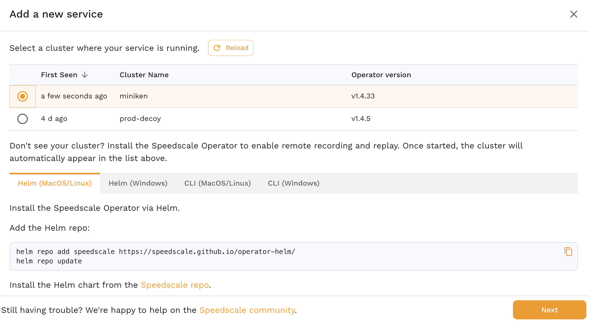
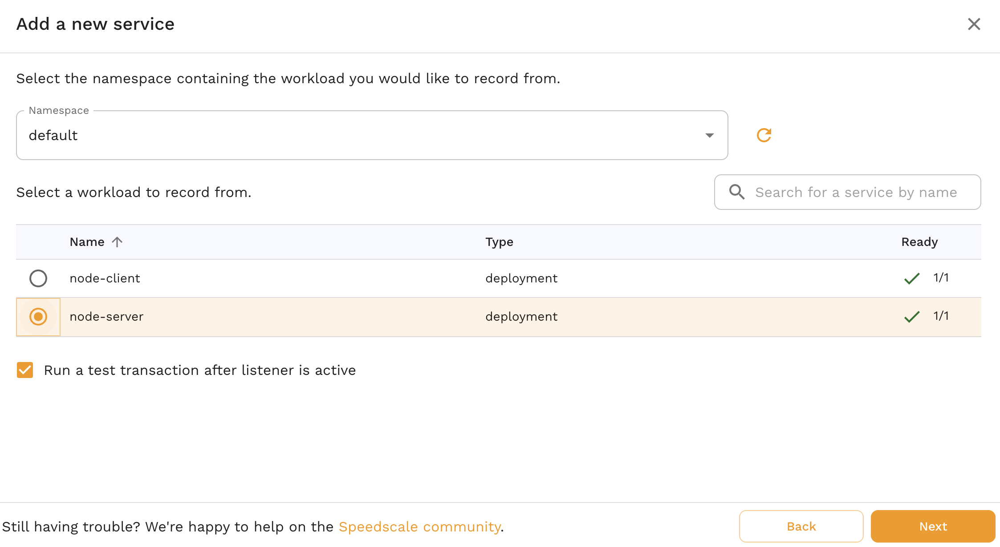
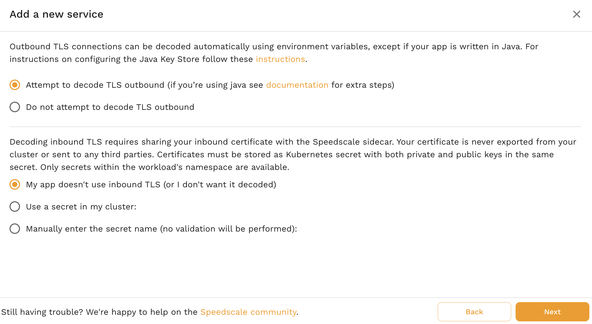
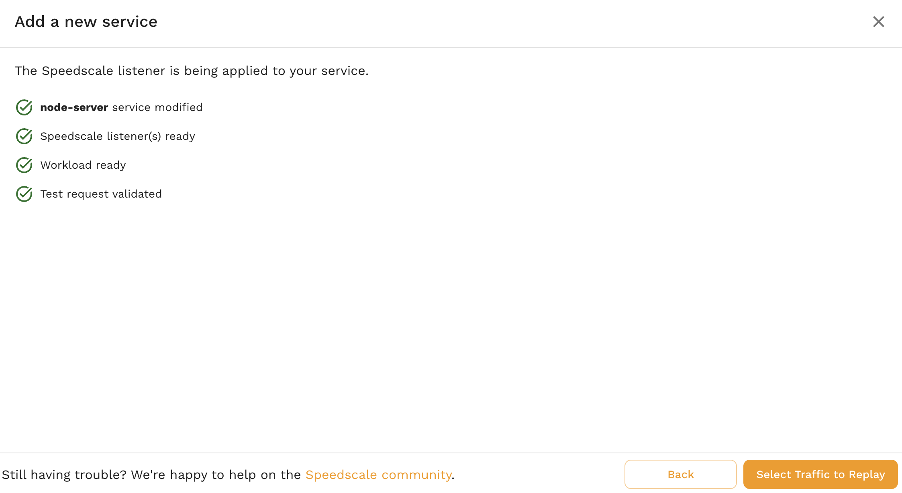
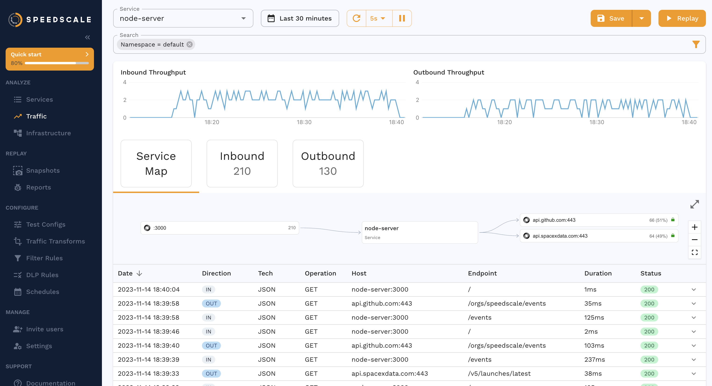
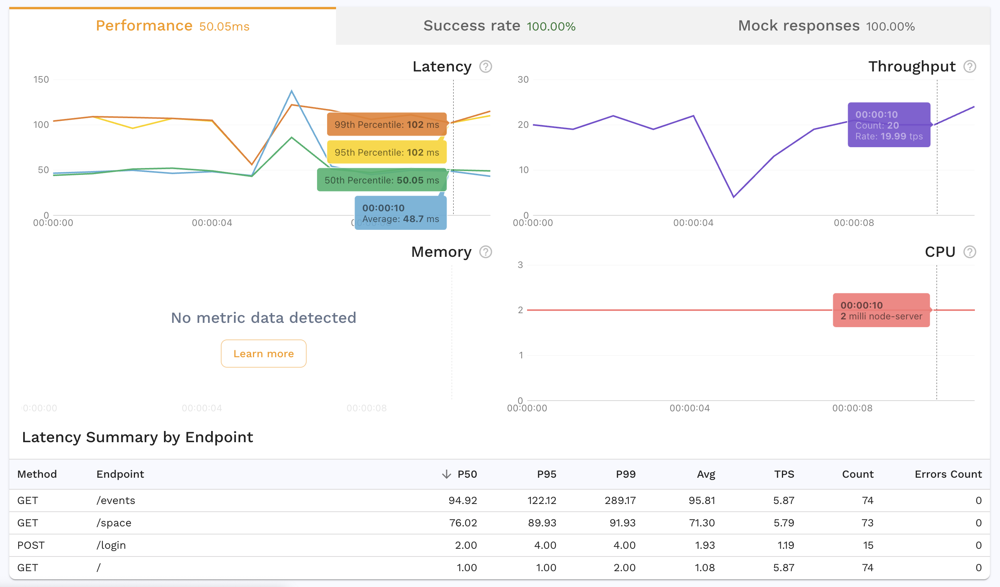

# Kubernetes Workflow

Pre-requisites:
* You need to install the [Speedscale helm chart](https://github.com/speedscale/operator-helm) first.

## Install and Run the App

First you need to deploy the manifests:

```
kubectl apply -k .
```

It should spin up 2 deployments (each with 1 pod), 1 service and 1 configmap. You can check the status of the pods with this:

```
kubectl get pods
```

If the output looks like this then it's working:

```
NAME                           READY   STATUS    RESTARTS   AGE
node-client-68f7c4fdcf-w5spx   1/1     Running   0          16s
node-server-b8997bcdf-gn772    1/1     Running   0          16s
```

## Capture 

You can add your service through the [Add a new service wizard](https://app.speedscale.com/?popupId=addNewKubernetes).



After you select your cluster and click next, you can see your namespaces. This demo is installed in the `default` namespace, you should see the workloads:



For the TLS settings, select the very first radio button `Attempt to decode TLS outbound` and this will work automatically for this NodeJS app!



The operator will automatically install the sidecar on your workload and you should get all green checkmarks:



Now you should be able to see the data in Speedscale traffic viewer.

## Replay 

The first step to replay is to [create a snapshot](https://docs.speedscale.com/guides/creating-a-snapshot/). After a few minutes you should see the data like this in your traffic viewer:



The next step is to click the `Replay` and follow the workflow using all the default values. Select your cluster and the `default` namespace. For the test report select the `Regression (1x traffic, with service mocks)` option and `Replay exactly as recorded`. This will kick off service mocks to mock out the SpaceX and GitHub API calls, and then replay the inbound traffic as a regression test case. After the test completes you should see a report.



Now try to run with some different test configs to try out performance testing, chaos, or other types of tests!
