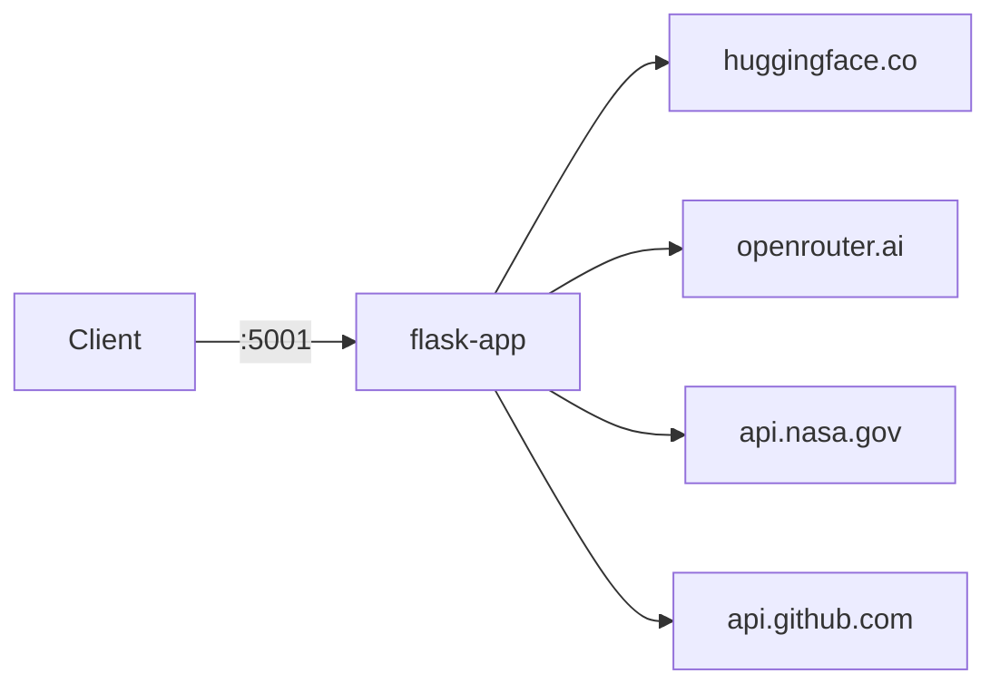

# python-server

Flask app that calls external APIs — useful for demonstrating proxymock record, mock, and replay.

## Endpoints

- `GET /healthz`
- `GET /models` — top downloaded models from Hugging Face
- `GET /models/<org>/<model>` — single model details (e.g. `/models/deepseek-ai/DeepSeek-R1`)
- `GET /llm/models` — LLM catalog and pricing from OpenRouter
- `GET /nasa` — NASA astronomy picture of the day
- `GET /events` — recent GitHub events for the Speedscale org

## Architecture



## Quick start

```bash
make install
make local
# listening on http://localhost:5001

curl localhost:5001/models | jq '.[0].id'
curl localhost:5001/llm/models | jq '.data[0].id'
curl localhost:5001/nasa | jq .title
```

## proxymock workflow

### Record

```bash
make capture
# hit endpoints in another terminal
curl localhost:4143/models
curl localhost:4143/llm/models
curl localhost:4143/nasa
curl localhost:4143/events
# ctrl-c to stop
```

### Mock

```bash
make mock
curl localhost:5001/models   # from recorded data, no real API calls
```

### Replay

```bash
make local &
make replay
```
