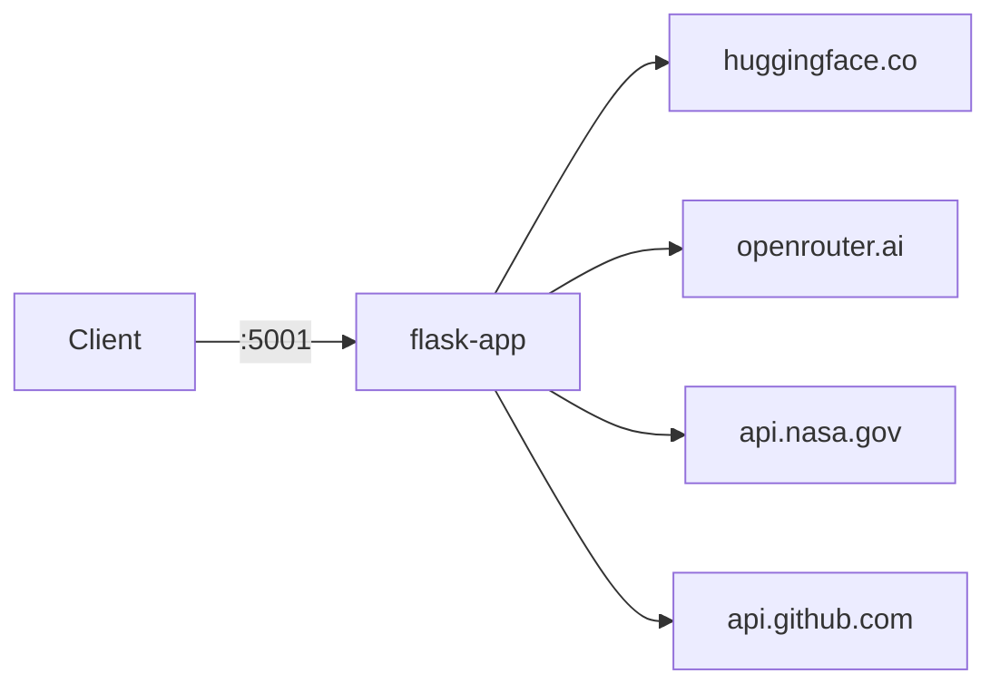
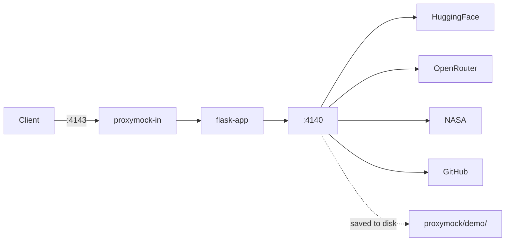

# python-server

Flask app that calls external APIs — useful for demonstrating proxymock record, mock, and replay.

## Endpoints

- `GET /healthz` — health check
- `GET /models` — top downloaded models from [Hugging Face](https://huggingface.co)
- `GET /models/<org>/<model>` — details for a specific model (e.g. `/models/deepseek-ai/DeepSeek-R1`)
- `GET /llm/models` — LLM model catalog and pricing from [OpenRouter](https://openrouter.ai)
- `GET /nasa` — NASA astronomy picture of the day
- `GET /events` — recent GitHub events for the Speedscale org

## Architecture



## Quick start

```bash
make install
make local
# Running on http://0.0.0.0:5001

make test
```

## proxymock workflow

### Record

Capture all outbound API calls while using the app:



```bash
make capture
# hit endpoints in another terminal
make test                    # or use test.http in your editor
# ctrl-c to stop
```

### Mock

Run the app with recorded responses instead of real APIs:


```bash
make mock

make test              # served from recorded data, no real API calls
```

### Replay

Turn recorded traffic into a load test:

```bash
make local &
make replay

# concurrent users
proxymock replay --in proxymock/demo --test-against http://localhost:5001 --vus 10

# CI gate
proxymock replay --in proxymock/demo --test-against http://localhost:5001 \
  --fail-if "requests.failed!=0"
```
