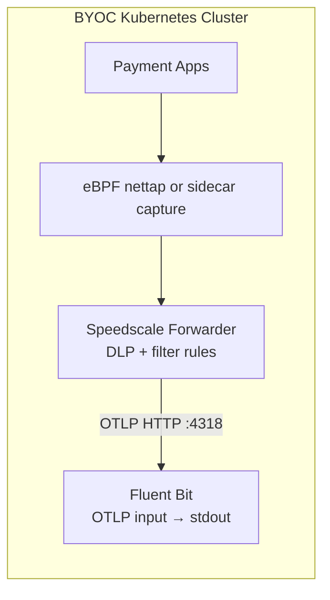

# Speedscale BYOC: Fluent Bit (Direct)

This reference architecture is the simplest BYOC setup: the Speedscale Forwarder ships RRPair logs directly to Fluent Bit via OTLP. Fluent Bit writes them to stdout — easy to verify with `kubectl logs`. It matches the [BYOC guide](https://docs.speedscale.com/guides/byoc).

For backends that add indexing and visualization, see the sibling scenarios:
- `../grafana` — Loki + Grafana
- `../elasticsearch` — Elasticsearch + Kibana (OTEL direct)
- `../fluent-bit` — Fluent Bit → Elasticsearch + Kibana

## Architecture



## Install (Minikube)

Run the provided script from this directory:

```bash
./scripts/start.sh
```

Or step by step:

```bash
minikube start

kubectl apply -f manifests/namespaces.yaml

helm repo add speedscale https://speedscale.github.io/operator-helm/
helm repo update

kubectl -n speedscale create secret generic speedscale-airgapped-apikey \
  --from-literal=SPEEDSCALE_API_KEY="<YOUR_API_KEY>" \
  --from-literal=SPEEDSCALE_APP_URL="app.speedscale.com"

helm upgrade --install speedscale-operator speedscale/speedscale-operator \
  -n speedscale \
  -f values/values.yaml

kubectl apply -f manifests/fluent-bit.yaml

kubectl -n speedscale get pods
kubectl -n observability get pods
```

## Verify

```bash
./scripts/verify.sh
```

Or stream live:

```bash
kubectl -n observability logs -f deploy/fluent-bit
```

You should see JSON lines containing `"source":"speedscale"` and RRPair fields like `direction`, `service`, `http`, etc.

## Optional: Add an OTEL Collector

If you need batching, attribute transforms, or fan-out to multiple backends, insert an OTEL Collector between the Forwarder and Fluent Bit. A reference config is in `otel/otel.yaml`. See comments in that file for deployment steps.

## Tear down

```bash
kubectl -n observability delete deploy,svc,cm --all
```
