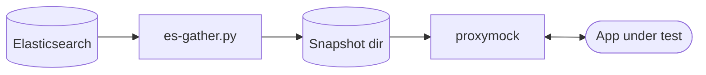

# Speedscale BYOC: Elasticsearch + Kibana

This reference architecture captures real traffic from your apps, ships it through the Speedscale Forwarder to your own Elasticsearch, and lets you slice it through Kibana — then pull any subset back out as a `proxymock`-replayable directory for tests.

Sibling scenario: [`grafana/`](../grafana/) does the same with Loki + Grafana instead. The two coexist on one cluster (separate `byoc-*` namespaces); pick which receives traffic by repointing the Forwarder's `byoc_otel.otel_endpoint`.

## Architecture

**Capture.** The Forwarder's `byoc_otel` exporter ships RRPairs as OTLP logs into your own Elasticsearch via the OTel Collector. Kibana sits on top for indexing, Discover, and ad-hoc queries.


**Replay.** `es-gather.py` queries any subset of Elasticsearch back out and writes a `proxymock`-readable directory matching the same shape as `loki-gather.py`'s output. Same real traffic you captured drives your tests.



## Prerequisites

- A Kubernetes cluster (any flavor — `kind`, `minikube`, EKS, GKE, AKS, k3s)
- `kubectl` configured against it
- `helm` v3
- A Speedscale API key (`SPEEDSCALE_API_KEY`) and your app URL

## Install

Two helm releases: the upstream Speedscale Operator chart (Forwarder + Nettap in the `speedscale` namespace) and the in-repo `chart/` (Elasticsearch + Kibana + OTel Collector in `byoc-elasticsearch`).

```bash
helm repo add speedscale https://speedscale.github.io/operator-helm/
helm repo update

kubectl -n speedscale create secret generic speedscale-airgapped-apikey \
  --from-literal=SPEEDSCALE_API_KEY="<YOUR_API_KEY>" \
  --from-literal=SPEEDSCALE_APP_URL="app.speedscale.com"

# 1. Speedscale Operator + Forwarder, pointing at this scenario's OTel Collector
helm upgrade --install speedscale-operator speedscale/speedscale-operator \
  -n speedscale --create-namespace \
  -f values/values.yaml

# 2. BYOC backend (ES + Kibana + OTel Collector)
helm upgrade --install byoc-elasticsearch ./chart \
  -n byoc-elasticsearch --create-namespace

kubectl -n speedscale get pods
kubectl -n byoc-elasticsearch get pods
```

`chart/values.yaml` documents every overridable knob (NodePorts, ES JVM heap, image versions, logs index name). To customize:

```bash
helm upgrade --install byoc-elasticsearch ./chart -n byoc-elasticsearch --create-namespace \
  --set elasticsearch.javaOpts="-Xms1g -Xmx1g" \
  --set logsIndex=my-rrpair-index
```

To inspect rendered manifests: `helm template byoc-elasticsearch ./chart -n byoc-elasticsearch`.

## Index + Visualize

ES and Kibana are both `Service: NodePort` (30032 and 30033 respectively) so you don't need a `kubectl port-forward` process babysitting your dev loop. Reach them via the node IP:

```bash
NODE_IP=$(minikube ip)   # or: kubectl get nodes -o wide

open "http://${NODE_IP}:30033"                  # Kibana (no auth — xpack.security off)
curl "http://${NODE_IP}:30032/_cat/indices?v"   # ES index list
```

In Kibana → **Discover** → create a data view on the `speedscale-rrpair` index pattern. Useful fields to expose as table columns:

- `Resource.cluster` — your cluster name (correct; the `Body.cluster` field reads `"undefined"` until forwarder bug S-11091 lands)
- `Attributes.service` — the service that produced the RRPair
- `Body.command` / `Body.status` / `Body.location` / `Body.direction` / `Body.duration` — structured request/response fields
- `@timestamp` — ingest time

> **`minikube --driver=docker` on macOS:** the node IP `192.168.49.2` lives inside Docker Desktop's hidden VM and isn't routable from your host. Either flip on Docker Desktop's "host networking" (Settings → Resources → Network), switch to a driver where the VM IP routes natively (OrbStack, vfkit, hyperkit), or run `socat` sidecars to bridge each port — see `speedstack/infra/minikube/speedscale-operator/install.sh` for the pattern.

## Replay (gather a subset of traffic into proxymock)

Once ES has some real traffic, pull any slice of it out as a directory `proxymock` reads:

```bash
NODE_IP=$(minikube ip)

python3 scripts/es-gather.py \
  --es-url   http://${NODE_IP}:30032 \
  --service  java-server \
  --status   2.. \
  --endpoint '^/spacex/.+' \
  --start    -15m \
  --out-dir  /tmp/spacex-snapshot

proxymock mock --in /tmp/spacex-snapshot
```

The gathered directory is the same shape `loki-gather.py` produces (and the same shape `speedctl proxymock cloud pull snapshot` produces after expanding a cloud snapshot) — so anything in the proxymock ecosystem that reads a recording works without changes. See `scripts/README.md` for filter flags, workflow notes (`mock` vs `replay`, IN vs OUT direction), and known gotchas.
