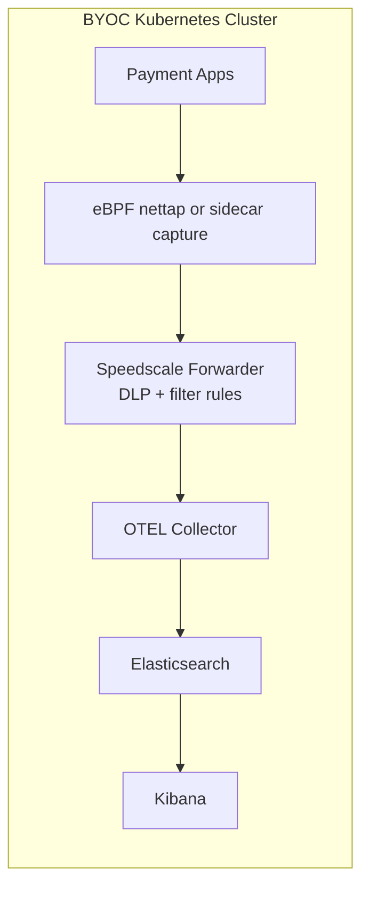

# Speedscale BYOC: Elasticsearch + Kibana

This reference architecture exports Speedscale RRPair logs through OTEL directly into Elasticsearch and visualizes in Kibana.

## Architecture



## Install (Minikube)

```bash
minikube start

kubectl apply -f manifests/namespaces.yaml

helm repo add speedscale https://speedscale.github.io/operator-helm/
helm repo update

kubectl -n speedscale create secret generic speedscale-airgapped-apikey \
  --from-literal=SPEEDSCALE_API_KEY="<YOUR_API_KEY>" \
  --from-literal=SPEEDSCALE_APP_URL="app.speedscale.com"

helm upgrade --install speedscale-operator speedscale/speedscale-operator \
  -n speedscale \
  -f values/values.yaml

kubectl apply -f manifests/elasticsearch-kibana.yaml
kubectl apply -f manifests/otel-collector.yaml

kubectl -n speedscale get pods
kubectl -n observability get pods
```

## Index + Visualize

- Indexing: Elasticsearch index `speedscale-rrpair`.
- Visualization: Kibana Discover.

```bash
kubectl -n observability port-forward svc/kibana 5601:5601
```

Open `http://localhost:5601`, create data view `speedscale-rrpair*`, and use Discover.
