# Speedscale BYOC — Fluent Bit → GCS data-lake scenario

Speedscale captures inbound + outbound traffic in the cluster and ships
RRPair logs through an OpenTelemetry Collector → Fluent Bit shipper → a
**Google Cloud Storage** bucket. Use this scenario when you want a durable
object-storage archive of every observed request/response — for compliance
retention, downstream replay/training pipelines, or BigQuery external
tables — instead of (or in addition to) a live query backend like
Elasticsearch or Loki.

## Architecture

```mermaid
flowchart LR
  subgraph K8s[BYOC Kubernetes cluster]
    Apps[Application pods]
    Cap[eBPF nettap / sidecar capture]
    Fwd[Speedscale Forwarder<br/>DLP + filter rules]
    OTel[OTel Collector<br/>OTLP gRPC :4317]
    FB[Fluent Bit<br/>opentelemetry input :4318]
  end
  GCS[(GCS bucket<br/>NDJSON.gz objects)]
  subgraph BQ[BigQuery + Data Studio]
    Ext[rrpair_ext<br/>external table]
    View[rrpair_view<br/>flattened]
    DS[Data Studio<br/>dashboards]
  end

  Apps --> Cap --> Fwd
  Fwd -->|OTLP gRPC| OTel
  OTel -->|OTLP HTTP| FB
  FB -->|PutObject<br/>XML API| GCS
  GCS -.->|read-on-query<br/>no copy| Ext
  Ext --> View --> DS
```



`byoc-grafana` and `byoc-elasticsearch` (sibling scenarios) are live-query
backends — you see traffic in a dashboard. This scenario is the **archive**
path: data lands as partitioned NDJSON objects in GCS, ready for cheap
long-term retention and batch consumption. The optional BigQuery layer
(`bq/` — external tables, no data copy) bolts SQL + Data Studio onto the
same bucket without paying for BQ storage.

## Why pick this over `byoc-grafana/` or `byoc-elasticsearch/`?

Pick `byoc-fluentbit/` when:

- You need **durable retention** of every RRPair (compliance, audit,
  forensic replay) without paying ES/Loki hot-storage prices.
- You want to **feed downstream pipelines** — BigQuery external tables,
  Dataflow jobs, ML training corpora, proxymock snapshot generation — from
  a single canonical NDJSON corpus.
- You want **multi-region archive** or **lifecycle policies** (auto-tier
  to Nearline/Coldline/Archive) that GCS handles natively.

Pick `byoc-grafana/` or `byoc-elasticsearch/` when you need an interactive
dashboard / live query UI.

The three scenarios coexist in their own namespaces; flip the forwarder's
`byoc_otel.otel_endpoint` to switch which one receives traffic.

## Prerequisites

1. **GCS bucket** in a GCP project you control:
   ```bash
   gcloud storage buckets create gs://my-rrpair-archive \
     --project=my-project \
     --location=us-central1 \
     --uniform-bucket-level-access
   ```

2. **Service account** scoped to that bucket:
   ```bash
   gcloud iam service-accounts create byoc-fluentbit \
     --project=my-project
   gcloud storage buckets add-iam-policy-binding gs://my-rrpair-archive \
     --member=serviceAccount:byoc-fluentbit@my-project.iam.gserviceaccount.com \
     --role=roles/storage.objectAdmin
   ```

3. **HMAC credentials** for the service account (FB's `s3` output reaches
   GCS via the S3-compatible XML API):
   ```bash
   gcloud storage hmac create \
     byoc-fluentbit@my-project.iam.gserviceaccount.com \
     --project=my-project
   # ^ prints accessId (GOOG1...) and secret. Save both.
   ```

4. **Kubernetes Secret** holding the HMAC creds (chart references but does
   NOT manage it, so credentials never live in helm history):
   ```bash
   kubectl create namespace byoc-fluentbit
   kubectl -n byoc-fluentbit create secret generic byoc-fluentbit-gcs \
     --from-literal=accessKeyId=GOOG1... \
     --from-literal=secretAccessKey=...
   ```

## Install (Helm)

```bash
# Speedscale Operator (forwarder + capture). Set otel_endpoint to this
# scenario's OTel Collector.
helm repo add speedscale https://speedscale.github.io/operator-helm/
helm repo update
helm upgrade --install speedscale-operator speedscale/speedscale-operator \
  -n speedscale --create-namespace \
  --set apiKey=YOUR_API_KEY \
  --set clusterName=YOUR_CLUSTER \
  --set 'forwarder.exporters.byoc_otel.otel_endpoint=http://otel-collector.byoc-fluentbit.svc.cluster.local:4317'

# This chart — OTel Collector + Fluent Bit, configured for your bucket.
helm upgrade --install byoc-fluentbit ./chart \
  -n byoc-fluentbit --create-namespace \
  --set gcs.bucket=my-rrpair-archive \
  --set gcs.region=us-central1
```

Then annotate one of your application deployments with
`capture.speedscale.com/enabled: "true"` to add it to nettap targets.
Objects appear in the bucket within ~30s (one upload per `total_file_size`
chunk or `upload_timeout` flush).

## Inspect the archive

```bash
# Recent objects
gcloud storage ls -r gs://my-rrpair-archive/** | tail -20

# Peek at a single object (objects are gzipped NDJSON)
gcloud storage cat gs://my-rrpair-archive/year=2026/month=05/day=25/hour=15/*.json.gz \
  | gunzip | head -5 | jq .
```

Default key layout (override via `gcs.keyFormat`):

```
gs://<bucket>/year=YYYY/month=MM/day=DD/hour=HH/<uuid>-<chunk-index>.json.gz
```

The Hive-style partition keys are designed for BigQuery external tables
and downstream tools that auto-detect partitions.

## Data shape

One OTLP LogRecord per NDJSON line. Fluent Bit's `s3` output flattens the
RRPair body fields to the top level (rather than nesting under a `Body`
key the way the `byoc-elasticsearch/` scenario's ES output does), so a
record looks like:

```json
{
  "@timestamp": "2026-05-25T15:04:30.314330Z",
  "service": "java-server",
  "namespace": "speedscale",
  "msgType": "rrpair",
  "command": "GET",
  "status": "200",
  "duration": 1.0,
  "http": {
    "req": { "method": "GET", "url": "/spacex/ship/...", "headers": {...} },
    "res": { "statusCode": 200, "headers": {...}, "bodyBase64": "..." }
  },
  "tags": { "captureMode": "eBPF", "k8sAppPodName": "...", "...": "..." },
  "dlpModified": true,
  "tokenList": { "JWT:Bearer ...": {...} },
  "netinfo": { "downstream": {...}, "upstream": {...} },
  "__internal__": { "log_metadata": { "otlp": {...} }, "group_attributes": {...} }
}
```

The `__internal__` key is Fluent Bit-side OTLP metadata (resource
attributes, observed_timestamp, etc.); downstream tooling can ignore or
strip it. The flat top-level body is the canonical RRPair shape that all
other Speedscale outputs produce.

## Replay from the archive

Use `scripts/gcs-gather.py` (sibling of `loki-gather.py` and `es-gather.py`
in the other two scenarios) to pull a time window of RRPairs and assemble
a proxymock-replayable snapshot:

```bash
python3 scripts/gcs-gather.py \
  --bucket   my-rrpair-archive \
  --service  java-server \
  --status   2.. \
  --endpoint '^/spacex/.+' \
  --start    -15m \
  --out-dir  /tmp/spacex-snapshot

proxymock mock --in /tmp/spacex-snapshot
```

What the script does:

- Enumerates only the Hive partitions (`year=YYYY/month=MM/day=DD/hour=HH/`)
  that overlap your `--start` / `--end` window — no full-bucket scan.
- Shells out to `gcloud storage ls` / `cat`, so it inherits whatever GCP
  credentials the caller already has (ADC, `gcloud login`, Workload
  Identity). No Python SDK dependency.
- Streams each gzipped NDJSON object, filters records in-memory, strips
  the `__internal__` OTLP envelope, backfills `cluster` from the OTLP
  resource attribute (works around the `cluster: "undefined"` forwarder
  bug, same as `es-gather.py`).
- Writes the canonical proxymock snapshot tree:
  `snapshot-<uuid>/<host>/<rrpair-uuid>.json` plus a
  `.metadata/snapshot.json` that records the bucket, partitions queried,
  and rrpair counts.

Pass `--dry-run` to see which partitions and objects the window touches
before downloading anything.

## Query + visualize (BigQuery + Data Studio)

The `bq/` directory wires the GCS bucket into BigQuery as an **external
table** — no data is copied into BigQuery storage, queries read GCS
directly. The first 1 TB/month of bytes scanned is free; at demo
volumes every query rounds to $0.

```bash
./bq/setup.sh <project-id> <bucket-name>
# Example:
./bq/setup.sh speedscale-demos speedscale-rrpair-demo
```

That creates:

- **Dataset** `speedscale_rrpair` (us-central1, colocated with the bucket).
- **External table** `rrpair_ext` over the Hive-partitioned bucket.
  `require_hive_partition_filter = TRUE` forces every query to include
  `WHERE year=… AND month=…` — without it, queries fail rather than
  full-scan the bucket. Nested fields (`http`, `tags`, etc.) keep their
  structure as `JSON` columns.
- **Flattened view** `rrpair_view` that pre-extracts the commonly-queried
  fields (`request_time`, `method`, `status_code`, `host`, `path`,
  `duration_ms`, `app_label`, …) into flat typed columns ready for BI
  tools.

Sample query:

```sql
SELECT host, path, method,
       COUNT(*)                                       AS reqs,
       APPROX_QUANTILES(duration_ms, 100)[OFFSET(95)] AS p95_ms
FROM `<project>.speedscale_rrpair.rrpair_view`
WHERE year=2026 AND month=5 AND day=25
GROUP BY host, path, method
ORDER BY reqs DESC;
```

To visualize, open Data Studio (free) with the data source pre-wired
to the view:

```
https://datastudio.google.com/reporting/create?c.reportId=&ds.ds0.connector=bigQuery&ds.ds0.projectId=<PROJECT_ID>&ds.ds0.type=TABLE&ds.ds0.datasetId=speedscale_rrpair&ds.ds0.tableId=rrpair_view
```

`bq/setup.sh` prints this URL with your project filled in. See `bq/README.md`
for suggested chart layout (requests-over-time, status mix, top endpoints,
p50/p95/p99 latency scorecards).

## Version pins

- **Fluent Bit 4.0.3** is required. FB 3.1.x's `opentelemetry` input
  collapses each `ResourceLogs` batch into a single FB record containing
  only resource/scope metadata and discards every individual `LogRecord`.
  The chart pins `4.0.3`.
- **OTel Collector contrib `0.108.0`** — used identically by `grafana/`
  and `elasticsearch/` scenarios.
- Fluent Bit has no native `gcs` output plugin in the upstream image;
  this chart uses the mature `s3` output pointed at GCS's S3-compatible
  XML (Interoperability) endpoint with HMAC credentials. This is the
  documented "FB → GCS" pattern.
