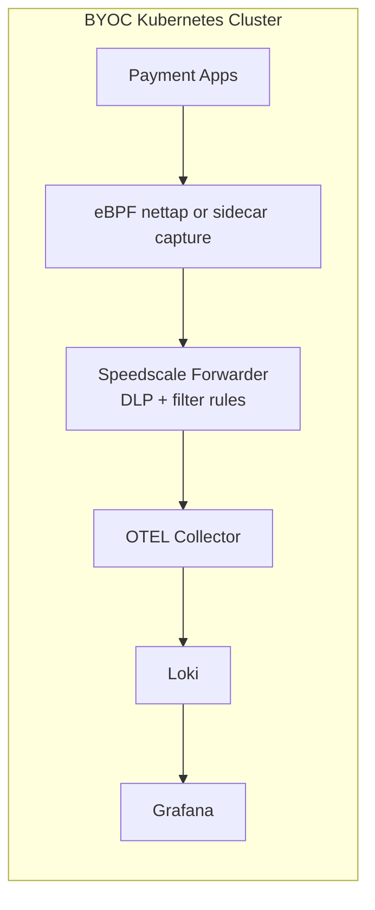

# Speedscale BYOC: Grafana + Loki

This reference architecture exports Speedscale RRPair logs through OTEL into Loki, then visualizes in Grafana.

## Architecture



## Install (Minikube)

```bash
minikube start

kubectl apply -f manifests/namespaces.yaml

helm repo add speedscale https://speedscale.github.io/operator-helm/
helm repo update

kubectl -n speedscale create secret generic speedscale-airgapped-apikey \
  --from-literal=SPEEDSCALE_API_KEY="<YOUR_API_KEY>" \
  --from-literal=SPEEDSCALE_APP_URL="app.speedscale.com"

helm upgrade --install speedscale-operator speedscale/speedscale-operator \
  -n speedscale \
  -f values/values.yaml

kubectl apply -f manifests/grafana-loki.yaml
kubectl apply -f manifests/otel-collector.yaml

kubectl -n speedscale get pods
kubectl -n observability get pods
```

## Index + Visualize

- Indexing: Loki stores logs and indexed labels.
- Visualization: Grafana Explore and dashboards.

```bash
kubectl -n observability port-forward svc/grafana 38030:3000
```

Open `http://localhost:38030` (admin/admin), then in Explore query `{source="speedscale"}`.

Two dashboards are auto-provisioned under the **Speedscale BYOC** folder:

- **Speedscale BYOC** — infra view (forwarder metrics, queue depths, raw log stream)
- **Speedscale Traffic** — RRPair traffic explorer (filter by service / method / status / endpoint regex; one-line-per-request format; expand any row for the full JSON with req/res bodies)

The host port `38030` is chosen to dodge the common 3000-3999 dev-server range. If you change it, change it consistently across `port-forward` and any docs that reference the URL.
