# Speedscale BYOC: Grafana + Loki

This reference architecture captures real traffic from your apps, ships it through the Speedscale Forwarder to your own Loki, and lets you slice it through Grafana — then pull any subset back out as a `proxymock`-replayable directory for tests.

## Architecture

The full loop, from production capture to replay against an app under test:

```mermaid
flowchart LR
  subgraph cluster["BYOC Kubernetes cluster"]
    direction TB
    apps["Your apps<br/>(real traffic)"]
    cap["Speedscale nettap<br/>eBPF capture"]
    fwd["Speedscale Forwarder<br/>DLP + filter rules<br/>byoc_otel exporter"]
    otel["OTel Collector<br/>:4317 gRPC&nbsp;·&nbsp;:4318 HTTP"]
    loki[("Loki<br/>RRPair logs<br/>indexed by<br/>cluster · service · namespace")]
    grafana["Grafana<br/><i>Speedscale Traffic</i><br/>dashboard"]

    apps -.-> cap
    cap --> fwd
    fwd ==>|OTLP| otel
    otel --> loki
    loki --> grafana
  end

  subgraph local["Local dev / CI"]
    direction TB
    gather["<b>loki-gather.py</b><br/>filter by service,<br/>endpoint, status, time"]
    snapshot[("Snapshot directory<br/>per-host .json<br/>RRPair files")]
    pm["proxymock<br/>mock / replay"]
    app["App under test"]

    gather --> snapshot
    snapshot --> pm
    pm <-->|"proxy :4140"| app
  end

  loki ==>|"LogQL query<br/>(any subset)"| gather
  grafana -.->|"explore,<br/>pick a filter"| gather

  classDef cluster fill:#e3f2fd,stroke:#1976d2,stroke-width:2px
  classDef local fill:#fff3e0,stroke:#f57c00,stroke-width:2px
  classDef storage fill:#f3e5f5,stroke:#7b1fa2

  class loki,snapshot storage
```



**Two halves.** The left half is the *capture* loop — Speedscale's operator + forwarder ship RRPairs into Loki, where you can index and visualize them like any other observability data. The right half is the *replay* loop — `loki-gather.py` pulls any subset out of Loki into a directory `proxymock` can read, so the same real traffic you captured drives your test environment.

The two halves run independently. You don't need a Speedscale Cloud round-trip; everything stays in your own infra.

## Install (Minikube)

```bash
minikube start

kubectl apply -f manifests/namespaces.yaml

helm repo add speedscale https://speedscale.github.io/operator-helm/
helm repo update

kubectl -n speedscale create secret generic speedscale-airgapped-apikey \
  --from-literal=SPEEDSCALE_API_KEY="<YOUR_API_KEY>" \
  --from-literal=SPEEDSCALE_APP_URL="app.speedscale.com"

helm upgrade --install speedscale-operator speedscale/speedscale-operator \
  -n speedscale \
  -f values/values.yaml

kubectl apply -f manifests/grafana-loki.yaml
kubectl apply -f manifests/otel-collector.yaml

kubectl -n speedscale get pods
kubectl -n observability get pods
```

## Index + Visualize

- Indexing: Loki stores logs and indexed labels.
- Visualization: Grafana Explore and dashboards.

```bash
kubectl -n observability port-forward svc/grafana 38030:3000
```

Open `http://localhost:38030` (admin/admin), then in Explore query `{source="speedscale"}`.

Two dashboards are auto-provisioned under the **Speedscale BYOC** folder:

- **Speedscale BYOC** — infra view (forwarder metrics, queue depths, raw log stream)
- **Speedscale Traffic** — RRPair traffic explorer (filter by service / method / status / endpoint regex; one-line-per-request format; expand any row for the full JSON with req/res bodies)

The host port `38030` is chosen to dodge the common 3000-3999 dev-server range. If you change it, change it consistently across `port-forward` and any docs that reference the URL.

## Replay (gather a subset of traffic into proxymock)

Once Loki has some real traffic, you can pull any slice of it out as a directory `proxymock` reads:

```bash
kubectl -n observability port-forward svc/loki 3101:3100 &

python3 scripts/loki-gather.py \
  --loki-url http://localhost:3101 \
  --service  java-server \
  --status   2.. \
  --endpoint '^/spacex/.+' \
  --start    -15m \
  --out-dir  /tmp/spacex-snapshot

proxymock mock --in /tmp/spacex-snapshot
```

The gathered directory is the same shape `speedctl proxymock cloud pull snapshot` produces after expanding a cloud snapshot — so anything in the proxymock ecosystem that reads a recording works without changes. See `scripts/README.md` for filter flags, workflow notes (`mock` vs `replay`, IN vs OUT direction), and known gotchas.
