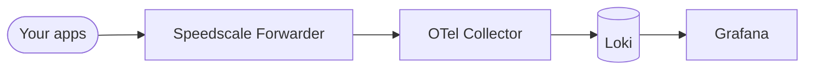
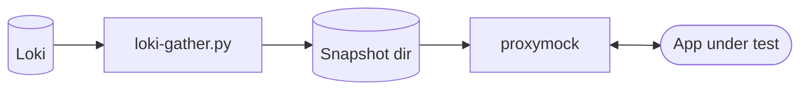

# Speedscale BYOC: Grafana + Loki

This reference architecture captures real traffic from your apps, ships it through the Speedscale Forwarder to your own Loki, and lets you slice it through Grafana — then pull any subset back out as a `proxymock`-replayable directory for tests.

## Architecture

**Capture.** The Forwarder's `byoc_otel` exporter ships RRPairs as OTLP logs into your own Loki — no Speedscale Cloud round-trip. Grafana sits on top for indexing, dashboards, and ad-hoc queries.



**Replay.** `loki-gather.py` queries any subset of Loki back out and writes a `proxymock`-readable directory. Same real traffic you captured drives your tests.



## Prerequisites

- A Kubernetes cluster (any flavor — `kind`, `minikube`, EKS, GKE, AKS, k3s)
- `kubectl` configured against it
- `helm` v3
- A Speedscale API key (`SPEEDSCALE_API_KEY`) and your app URL

## Install

```bash
kubectl apply -f manifests/namespaces.yaml

helm repo add speedscale https://speedscale.github.io/operator-helm/
helm repo update

kubectl -n speedscale create secret generic speedscale-airgapped-apikey \
  --from-literal=SPEEDSCALE_API_KEY="<YOUR_API_KEY>" \
  --from-literal=SPEEDSCALE_APP_URL="app.speedscale.com"

helm upgrade --install speedscale-operator speedscale/speedscale-operator \
  -n speedscale \
  -f values/values.yaml

kubectl apply -f manifests/grafana-loki.yaml
kubectl apply -f manifests/otel-collector.yaml

kubectl -n speedscale get pods
kubectl -n observability get pods
```

## Index + Visualize

- Indexing: Loki stores logs and indexed labels.
- Visualization: Grafana Explore and dashboards.

Grafana and Loki are both `Service: NodePort` (30030 and 30031 respectively) so you don't need a `kubectl port-forward` process babysitting your dev loop. Reach them via the node IP:

```bash
NODE_IP=$(minikube ip)   # or: kubectl get nodes -o wide

open "http://${NODE_IP}:30030"   # Grafana (admin/admin)
curl "http://${NODE_IP}:30031/ready"   # Loki
```

In Grafana Explore, query `{source="speedscale"}`. Two dashboards are auto-provisioned under the **Speedscale BYOC** folder:

- **Speedscale BYOC** — infra view (forwarder metrics, queue depths, structured RRPair log stream)
- **Speedscale Traffic** — RRPair traffic explorer (filter by service / method / status / endpoint regex; one-line-per-request format; expand any row for the full JSON with req/res bodies)

> **`minikube --driver=docker` on macOS:** the node IP `192.168.49.2` lives inside Docker Desktop's hidden VM and isn't routable from your host. Either flip on Docker Desktop's "host networking" (Settings → Resources → Network), switch to a driver where the VM IP routes natively (OrbStack, vfkit, hyperkit), or run a `socat` sidecar to bridge each port — see `speedstack/infra/minikube/speedscale-operator/install.sh` for the pattern.

## Replay (gather a subset of traffic into proxymock)

Once Loki has some real traffic, you can pull any slice of it out as a directory `proxymock` reads:

```bash
NODE_IP=$(minikube ip)

python3 scripts/loki-gather.py \
  --loki-url http://${NODE_IP}:30031 \
  --service  java-server \
  --status   2.. \
  --endpoint '^/spacex/.+' \
  --start    -15m \
  --out-dir  /tmp/spacex-snapshot

proxymock mock --in /tmp/spacex-snapshot
```

The gathered directory is the same shape `speedctl proxymock cloud pull snapshot` produces after expanding a cloud snapshot — so anything in the proxymock ecosystem that reads a recording works without changes. See `scripts/README.md` for filter flags, workflow notes (`mock` vs `replay`, IN vs OUT direction), and known gotchas.
