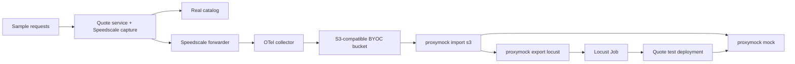

# Locust tests from captured traffic

Capture HTTP requests and dependency responses in Kubernetes, store them in your own S3-compatible bucket, and download them with proxymock. Export the inbound requests to Locust. Run Locust against a second copy of the application whose dependency calls are answered by Speedscale mocks.

The sample quote service calls a catalog service to obtain a price. The test shuts down the catalog before starting Locust. The expected quote still contains `"total": 42`.



## Prerequisites

- A disposable Kubernetes namespace, `kubectl`, Docker, and a Speedscale installation with a reachable forwarder.
- A BYOC S3 bucket and the [Speedscale BYOC S3 collector](https://github.com/speedscale/speedscale-byoc/tree/main/charts/fluentbit-s3). The forwarder must send captured traffic to that collector. Existing cloud export settings still apply.
- AWS credentials with list/read access to the bucket on the machine running proxymock. The collector needs its own write credentials.
- A proxymock build that lists `locust` in `proxymock export --help`. This exporter must be released before the example works with the normal downloaded CLI.
- A container registry accessible to the test cluster, or a local cluster image loader.

The capture deployment uses separate Speedscale goproxy sidecars for inbound reverse proxy capture and outbound forward proxy capture. Port 8080 captures inbound requests; the application sends dependency requests through port 4140. This avoids changing cluster-wide injection settings. On an existing eBPF-enabled workload, keep your normal capture configuration and start at the bucket import step.

## 1. Configure BYOC capture

Follow the BYOC chart's setup instructions for bucket credentials and installation. For an existing Speedscale operator Helm release, the relevant values are:

```yaml
forwarder:
  exporters:
    byoc_locust:
      otel_endpoint: http://otel-collector.byoc-s3.svc.cluster.local:4317
      filter_rule: standard
      dlp_config_id: standard
```

Merge these values into your existing Helm values and use the chart version already deployed. Preserve other exporters. Confirm the collector can write objects before recording the sample. Both inbound and outbound records are required; a filter that keeps only inbound traffic cannot supply the dependency mocks.

From this directory:

```sh
export KUBE_CONTEXT=my-test-cluster
export NAMESPACE=locust-byoc
export BUCKET=my-traffic-bucket
export AWS_REGION=us-east-1
export FROM=$(date -u +%Y-%m-%dT%H:%M:%SZ)
./run.sh capture
```

By default the sidecar connects to `speedscale-forwarder.speedscale.svc.cluster.local:8888`. Set `FORWARDER_ADDR` before `capture` when your forwarder uses another address. The seed requests must return `{"sku": "widget", "total": 42}`.

## 2. Download and export

Wait for the collector's batch interval to elapse and confirm objects have reached the bucket, then close the capture window:

```sh
export TO=$(date -u +%Y-%m-%dT%H:%M:%SZ)
./run.sh export
```

For an S3-compatible endpoint, also set `S3_ENDPOINT_URL` and `AWS_REGION`. `PREFIX` defaults to `byoc/`. The script runs these two operations:

```sh
proxymock import s3 --bucket "$BUCKET" --prefix byoc/ \
  --from "$FROM" --to "$TO" --namespace "$NAMESPACE" --out ./traffic
proxymock export locust --in ./traffic --service quote-capture --out locustfile.py
```

The import retains both directions. The export selects inbound HTTP requests to the recorded `quote-capture` host. Here `--service` on export matches the HTTP request host; the import command's `--service` filter matches capture service metadata. Do not substitute one for the other.

Inspect the downloaded files before sharing them. Request bodies and authentication headers become part of the generated test. Export does not run transforms or refresh credentials. Neither the capture nor the generated file is committed by this example.

## 3. Build the mock image

The mock image contains only the downloaded traffic and a pinned proxymock release. It does not need the new exporter at runtime.

```sh
export MOCK_IMAGE=your-registry/locust-byoc-mocks:demo
# Choose the architecture of your Kubernetes nodes.
docker build --platform linux/amd64 -f Dockerfile.mocks -t "$MOCK_IMAGE" .
docker push "$MOCK_IMAGE"
```

For arm64 nodes use `--platform linux/arm64`. On minikube, you can use `minikube image load "$MOCK_IMAGE"` instead of pushing. Treat the image as traffic data and keep it in a private registry. It uses `--no-passthrough`, so an unmatched dependency request fails instead of reaching the real catalog.

## 4. Run in Kubernetes

Provide the mock server's Speedscale API key as a Kubernetes Secret. It is used at startup for `proxymock init` and never included in the image. Set `SPEEDSCALE_API_KEY` in your shell from your normal secret manager, then create the Secret:

```sh
kubectl --context "$KUBE_CONTEXT" -n "$NAMESPACE" create secret generic locust-proxymock \
  --from-literal=SPEEDSCALE_API_KEY="$SPEEDSCALE_API_KEY"
./run.sh test
```

This starts the mock server, scales the real catalog to zero, deploys the test application with `http_proxy=http://mocks:4140`, and runs the exported Locust file as a Kubernetes Job. The Job uses five users, one new user per second, and a 30-second run. It targets `http://quote-test:8080` through Locust's `--host` override. The quote application itself receives real HTTP requests; its catalog calls use the recorded mocks.

Success means the Job completes with zero request failures, the real catalog has no pods, and a direct quote request still returns the recorded price. Logs are available with:

```sh
kubectl --context "$KUBE_CONTEXT" -n "$NAMESPACE" logs job/locust
kubectl --context "$KUBE_CONTEXT" -n "$NAMESPACE" logs deployment/mocks
kubectl --context "$KUBE_CONTEXT" -n "$NAMESPACE" get pods -l app=locust-catalog
```

For a local Locust UI, port-forward the test service and use the same generated file:

```sh
kubectl --context "$KUBE_CONTEXT" -n "$NAMESPACE" port-forward service/quote-test 8080:8080
# In another terminal:
locust -f locustfile.py --host http://localhost:8080
```

## Limits and troubleshooting

- Only HTTP/HTTPS requests are exported. The generated task iterates over the exported records once, then waits one second. This is a recorded request sequence, not a reconstructed user session or a model of production arrival rates.
- Locust checks captured response status codes. It does not compare response bodies or execute Speedscale transforms. Change the generated script for token refresh, data correlation, custom waits, or body assertions.
- `--host` redirects every exported request to one test deployment. Use export's `--service` filter when the input contains unrelated request hosts.
- If export reports no HTTP requests, check the capture time window, namespace, object prefix, and recorded Host field. Do not import only successful inbound requests: the outbound dependency responses must remain in `traffic/`.
- A 502 from the quote service usually means no dependency mock matched or the mock server was not ready. Inspect the mock logs. Do not disable `--no-passthrough` to make the test pass.
- The sample packages a small capture in an image and mounts a small Locust file in a ConfigMap. For large captures, download to a volume in an init container; Kubernetes ConfigMaps have a 1 MiB size limit.

## Cleanup

```sh
./run.sh cleanup
```

Cleanup removes only this example's named workloads, services, and ConfigMaps. It leaves the namespace, API-key Secret, BYOC infrastructure, bucket data, and mock image in place. Remove those separately when no longer needed. The real sample catalog is removed as part of cleanup.
